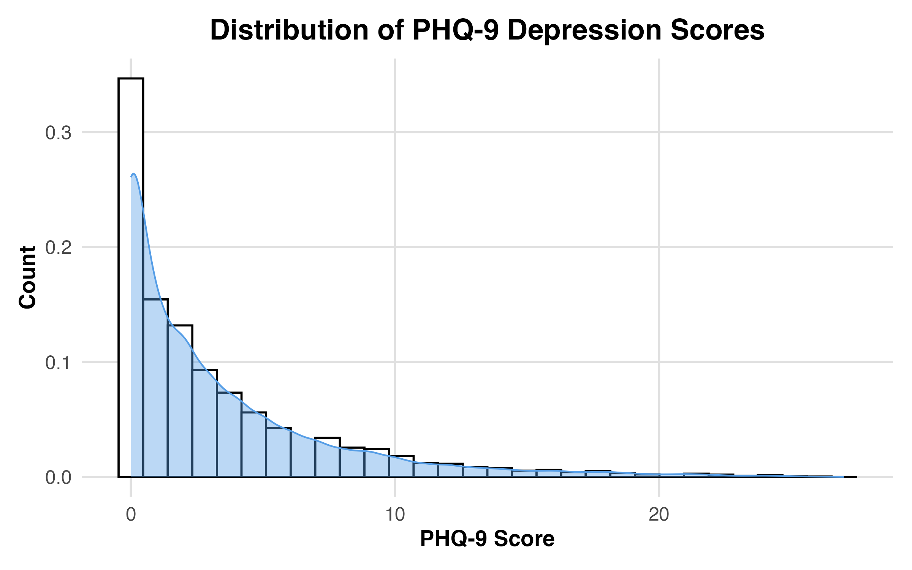
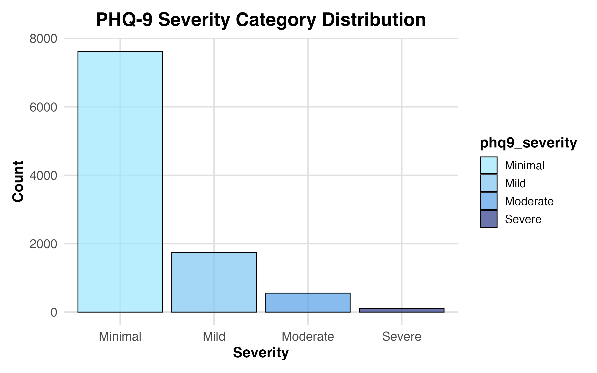
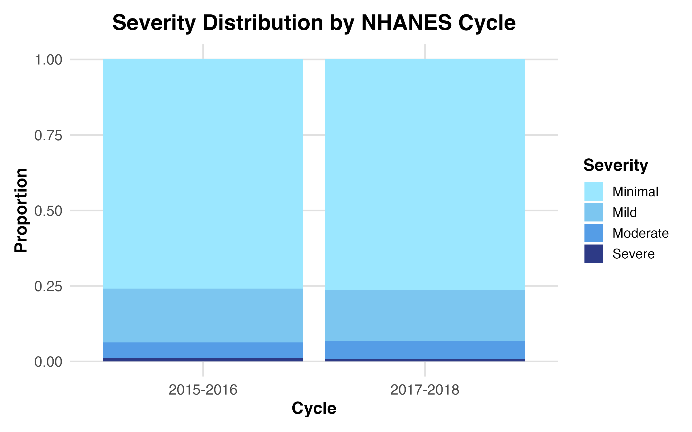

# NHANES Mental Health Workflow

This folder contains a self-contained, reproducible workflow for analyzing mental-health–related variables from the NHANES survey.  
The notebook walks through data loading, variable cleaning, scale scoring (e.g., PHQ-9), exploratory analysis, and basic visualizations.





---

## Contents

- **mental_health_workflow.qmd** — source notebook  
- **mental_health_workflow.html** — rendered analysis (tables + plots)  
- **R/** — modular R scripts for loading, cleaning, scoring, and plotting  
- **outputs/** — exported tables, figures, and rendered reports  
- **README.md** — this file  

---

## View the Analysis

Open the full rendered notebook here:

**`mental_health_workflow.html`**

(Click “Download” or “Raw” on GitHub if it does not display directly in your browser.)

---

## ▶️ Running the Notebook Yourself

1. Download the relevant NHANES data files from the CDC website:  
   https://wwwn.cdc.gov/nchs/nhanes/

2. Place the XPT files inside a `data/` folder **(not included in this repo)**.

3. Edit the file paths at the top of the QMD:

```r
data_dir <- "data/"
```

4. Render the notebook using Quarto:

```r
quarto::quarto_render("mental_health_workflow.qmd")
```

---

## Data

Raw NHANES data is **not included** in this repository.  
Users must download the public datasets directly from the CDC NHANES portal.
