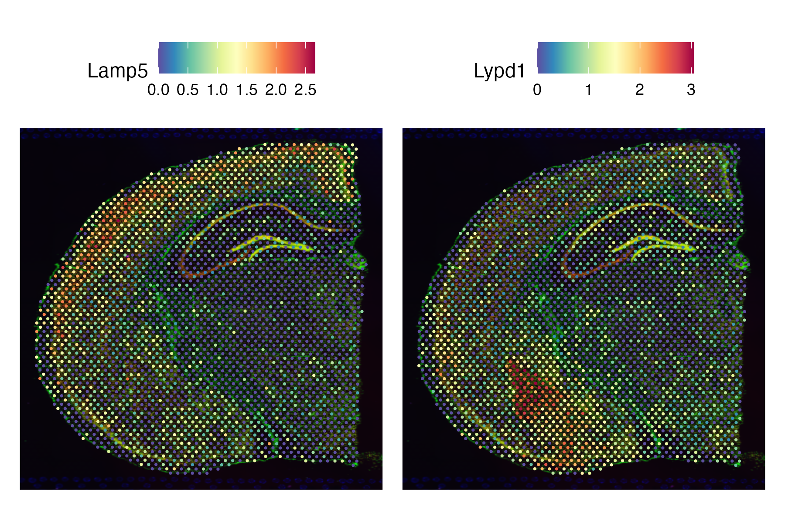

# Seurat Visium Demo

This folder contains a small, self-contained demonstration of a Seurat workflow using 10x Genomics Visium spatial transcriptomics data.  
The notebook walks through QC, normalization, PCA, UMAP, clustering, and marker identification.



---

## Contents

- **seurat_demo.Rmd** — source notebook  
- **seurat_demo.html** — rendered analysis (plots + output)  
- **figures/** — exported figures from the notebook  
- **README.md** — this file

---

## View the Analysis

Open the full HTML notebook here:

**`seurat_demo.html`**

(Click “Download” or “Raw” on GitHub if your browser does not display it directly.)

---

## ▶️ Running the Notebook Yourself

1. Download the dataset from 10x Genomics:  
   https://www.10xgenomics.com/datasets/adult-mouse-brain-section-1-coronal-stains-dapi-anti-neu-n-1-standard-1-1-0

2. Place the dataset inside a `data/` folder **(not included in this repo)**.

3. Edit the path at the top of the Rmd:

```r
data_dir <- "data/V1_Adult_Mouse_Brain_Coronal_Section_1"
```

4. Knit the notebook to HTML.

---

## Data

Raw Visium data is **not included** in this repository due to size and licensing constraints.  
Users must download the data directly from 10x Genomics.
