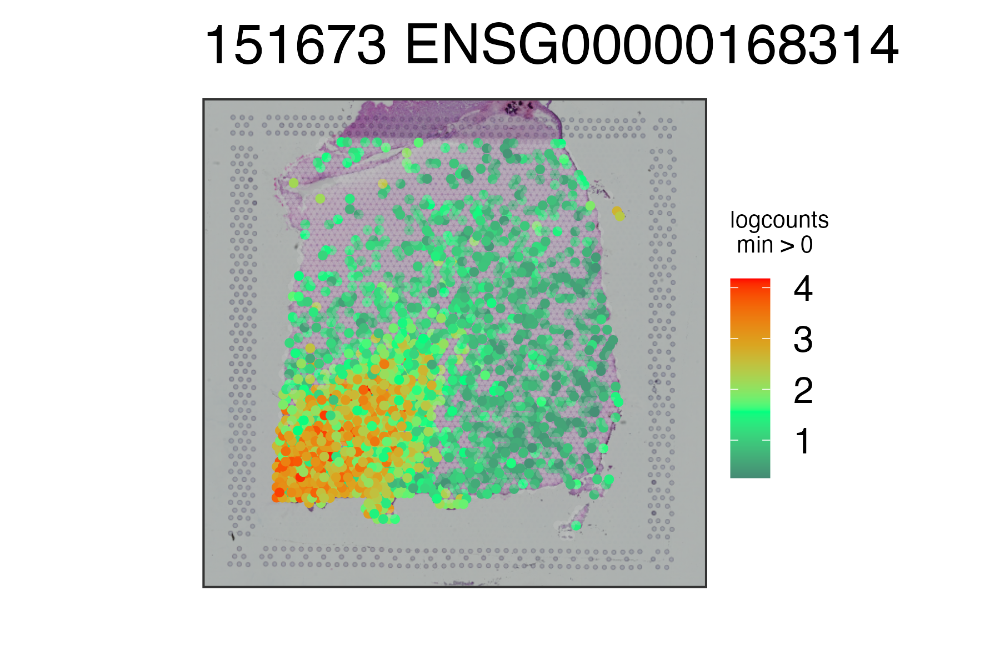

# spatialLIBD Demo

This folder contains a demonstration of the **spatialLIBD** workflow using publicly available DLPFC Visium data retrieved through ExperimentHub.  
The notebook showcases data loading, object exploration, spatial visualization, gene-level expression plots, and access to precomputed modeling results.



---

## Contents

- **spatiallibd_demo.Rmd** — source notebook  
- **spatiallibd_demo.html** — rendered analysis (plots + output)  
- **figures/** — exported figures from the notebook  
- **README.md** — this file

---

## View the Analysis

Open the full HTML notebook here:

**`spatialLIBD_demo.html`**

(Click “Download” or “Raw” on GitHub if your browser does not display it directly.)

---

## ▶️ Running the Notebook Yourself

The dataset used in this demo is automatically downloaded through `spatialLIBD::fetch_data()` using ExperimentHub.  
No manual download is required.

If you want to cache datasets locally instead of repeated downloads:

```r
ExperimentHub::setExperimentHubOption("CACHE", "data/")
```

Then rerun the notebook.

---

## Data

Raw DLPFC Visium data is **not included** in this repository due to size and licensing restrictions.  
The `fetch_data()` function retrieves processed objects directly from ExperimentHub.
